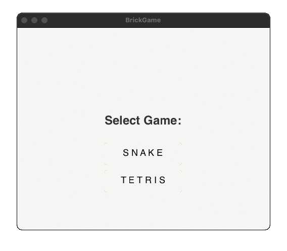
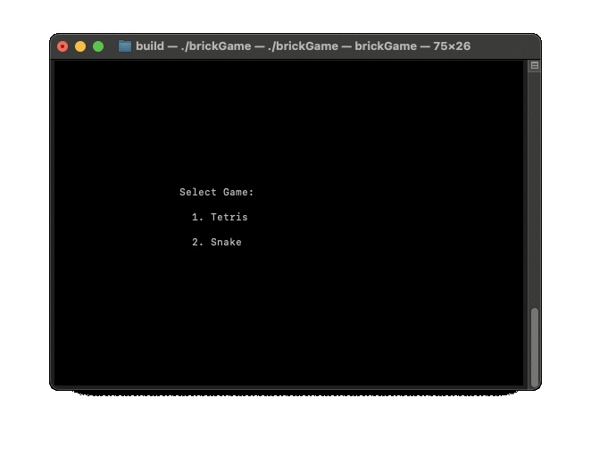

## CPP_BrickGame

### Описание

CPP_BrickGame представляет собой реализацию классической игры "Змейка" на языке C++ с использованием ООП и паттерна MVC. Проект включает десктопный графический интерфейс на базе GTK+, и консольный интерфейс с использованием библиотеки ncurses. Так же реализована поддержка обоих интерфейсов для проекта [C_brick_game_tetris](https://github.com/clifforc/C_brick_game_tetris) и возможность выбора игры при запуске. 

### Возможности

- **Игровая механика**
  - Автоматическое движение змейки с возможностью изменения направления с помощью стрелок.
  - Сбор "яблок" для увеличения длины змейки.
  - Победа при достижении длины змейки в 200 пикселей.
  - Проигрыш при столкновении со стенами или собственным телом.
  - Ускорение движения змейки при зажатии клавиши действия.
  - Начальная длина змейки — 4 пикселя.
  - Размер игрового поля — 10 пикселей в ширину и 20 пикселей в высоту.

- **Дополнительные функции**
  - Подсчет очков и сохранение рекордов.
  - Механика уровней: увеличение уровня и скорости змейки каждые 5 очков, максимум 10 уровней.
  - Поддержка как графического, так и консольного интерфейсов.
  - Покрытие логики игры unit-тестами с использованием Google Test.

### Технологии

- Язык программирования: C++
- Паттерн проектирования: MVC (Model-View-Controller)
- Графическая библиотека: GTK+
- Консольная библиотека: ncurses
- Система сборки: Makefile
- Библиотека для тестирования: Google Test

### Десктопная версия



### Консольная версия



### Установка

1. **Клонирование репозитория**

   ```bash
   git clone https://github.com/clifforc/cpp_brickgame.git
   ```

2. **Установка консольной версии**

   ```bash
   make install
   ```
   
3. **Запуск консольной версии**

   ```bash
   build/./brickGame
   ```
   
4. **Установка десктопной версии**

   ```bash
   make install_gtk
   ```

5. **Запуск десктопной версии**

   ```bash
   build/./brickGame2
   ```